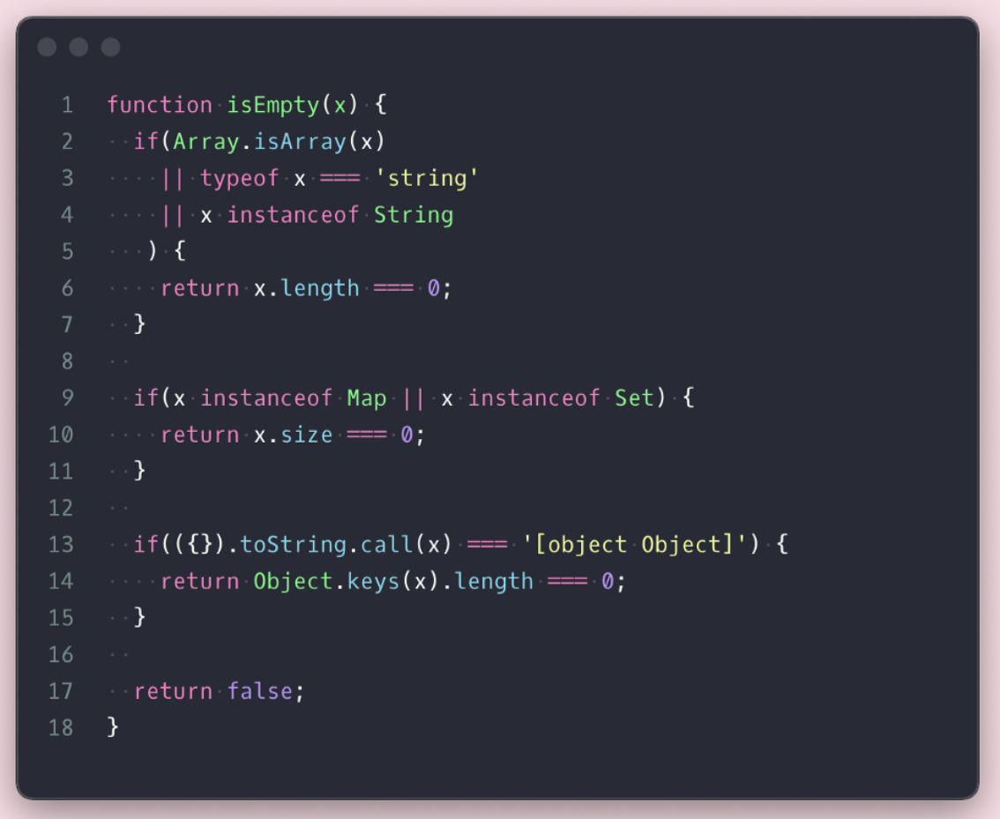
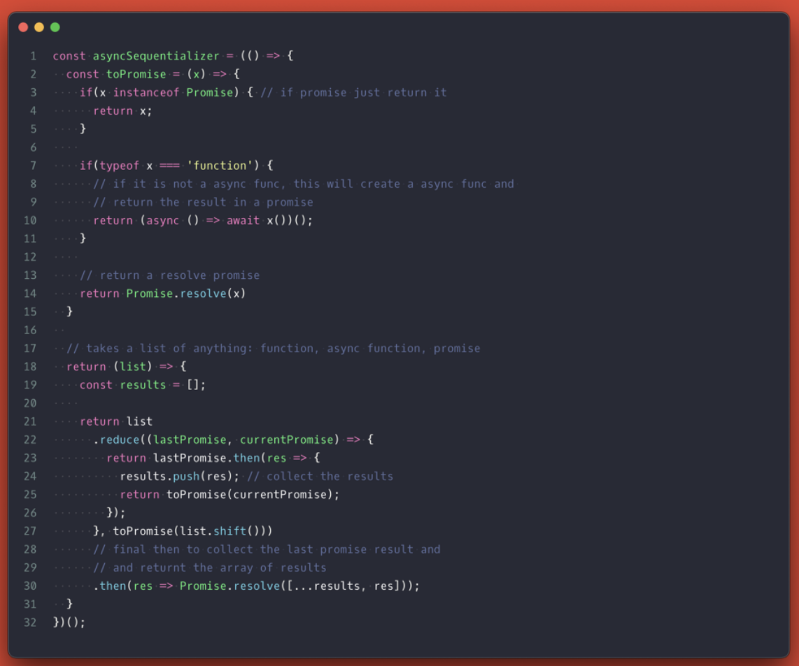

# 25 JavaScript Tricks You Need To Know About

Including some useful bits of code and utilities

[Link 🔗](https://medium.com/javascript-in-plain-english/25-javascript-code-solutions-utility-tricks-you-need-to-know-about-3023f7ed993e)

<!-- 알아두면 개발하기 편한 25가지 자바스크립트 유틸 코드입니다. Type / Empty 체크, 범위 설정 등 실무에서 유용하게 사용할 수 있는 코드들이 정리되어 있습니다. -->
There are 25 JavaScript Util codes that are easy to develop if you know them. Type / Empty checks, range settings, and other useful codes are organized.

## 목차

[1. Type check util](#1-type-check-util) 
[2. Check for empty](#2-check-for-empty) 
[3. Get any list last item](#3-get-any-list-last-item) 
[4. Random number generator with a range](#4-random-number-generator-with-a-range) 
[5. Random id generator](#5-random-id-generator) 
[6. Create a range of numbers](#6-create-a-range-of-numbers) 
[7. Format JSON string and stringify anything](#7-format-json-string-and-stringify-anything) 
[8. Execute promise sequentially](#8-execute-promise-sequentially) 
[9. Polling data](#9-polling-data) 
[10. Wait for all Promises to complete](#10-wait-for-all-promises-to-complete) 
[11. Swap array values place](#11-swap-array-values-place) 
[12. Conditional Object key](#12-conditional-object-key) 
[13. Use variables as the object key](#13-use-variables-as-the-object-key) 
[14. Check for key in object](#14-check-for-key-in-object) 
[15. Remove Array duplicates](#15-remove-array-duplicates) 
[16. Do “break” and “continue” in Array forEach](#16-do-break-and-continue-in-array-foreach) 
[17. Destructuring with alias name and default values](#17-destructuring-with-alias-name-and-default-values) 
[18. Optional Chaining and nullish coalescing](#18-optional-chaining-and-nullish-coalescing) 
[19. Extend class with functions](#19-extend-class-with-functions) 
[20. Extend constructor functions](#20-extend-constructor-functions) 
[21. Loop anything](#21-loop-anything) 
[22. Make function argument required](#22-make-function-argument-required) 
[23. Create modules or singletons](#23-create-modules-or-singletons) 
[24. Deep clone object](#24-deep-clone-object) 
[25. Deep freeze object](#25-deep-freeze-object) 

---

## 1. Type check util

JavaScript is not a strongly typed language and to get that your best solution is TypeScript which I recommend but, sometimes all you need is a simple type check which JavaScript allows you to do with the “typeof” keyword.
The problem with “typeof” is that if you use it for some primitives and function it works great but for array and objects it becomes hard to know the difference since they are both considered “objects”

---

 

## 2. Check for empty

Sometimes you just need to know if something is empty and depending on what you are checking, you need to use different methods like, checking the length, size, or if it contains any child elements. This util unifies all of that allowing you to check the size of String, Object, Array, Map, and Set.

---

 

## 3. Get any list last item

Other languages make this a method or function you can call on the array, but for JavaScript, you need to do some work.

---

 

## 4. Random number generator with a range

If sometimes you need to generate random numbers but you want these numbers to be in a range, you need this small utility.

---

 

## 5. Random id generator

Just need some id? No need to install a new library for that unless you need some more complex ID generators like UUID. Check these options which may be enough to get going. You can start from the current time in milliseconds or a specific Integer and increment, or you can generate an ID from alphanumeric characters.

---

 

## 6. Create a range of numbers

One thing I love in Python is the [range](https://docs.python.org/3.3/library/stdtypes.html?highlight=range#range) function and I often need it coding in JavaScript. Here is a simple implementation of it that is perfect for [for…of](https://developer.mozilla.org/en-US/docs/Web/JavaScript/Reference/Statements/for...of) loop and whenever you need numbers in a specific range.

---

 

## 7. Format JSON string and stringify anything

I find myself using this a lot when working on something with NodeJs to log objects to the console. The [JSON.stringify](https://developer.mozilla.org/en-US/docs/Web/JavaScript/Reference/Global_Objects/JSON/stringify) takes a third parameter that must be a number of spaces to indent the line with. The second parameter can be null but you can use it to handle things like function, Set, Map, and Symbol that the [JSON.stringify](https://developer.mozilla.org/en-US/docs/Web/JavaScript/Reference/Global_Objects/JSON/stringify) method does not handle or simply ignores.

---

 

## 8. Execute promise sequentially

If you have a bunch of asynchronous or normal function that returns a promise that you need to execute one after the other, this utility can help a lot. It takes a list of functions or promises and sequentially resolves them using the array [reduce](https://www.youtube.com/watch?v=DTmToxWZX9I&list=PLpWvGP6yhJUigZr2vQgbqpTv_HLQ6eZsz&index=7) method.

---

 

## 9. Polling data

If you ever need to keep checking for data updates but don’t have WebSocket available in your system, this util lets you do just that. It is great for cases where you upload a file and you want to keep checking if the file is done processing, or you are working with a third-party API like dropbox or uber and you want to keep checking whether the process is complete or the ride has reached the destination.

---

 

## 10. Wait for all Promises to complete

This is not quite a code solution but a good to know about the [Promise API](https://developer.mozilla.org/en-US/docs/Web/JavaScript/Reference/Global_Objects/Promise). It is constantly evolving and I used to have a code solution for the now available methods “[allSettled](https://developer.mozilla.org/en-US/docs/Web/JavaScript/Reference/Global_Objects/Promise/allSettled)”, “[race](https://developer.mozilla.org/en-US/docs/Web/JavaScript/Reference/Global_Objects/Promise/race)” and “[any](https://developer.mozilla.org/en-US/docs/Web/JavaScript/Reference/Global_Objects/Promise/any)” but I am glad just to tell you about them instead of sharing a code implementation of them.

---

 

## 11. Swap array values place

ES6 made it easy to swap values from places in the array. Not that this is a hard thing to do but it is a good one to know about.

---

 

## 12. Conditional Object key

This trick is my favorite and I find myself using it a lot when working with React updating states. It simply lets you conditionally insert a key into a spread object by wrapping the condition in parenthesis.

---

 

## 13. Use variables as the object key

Another one that comes handy is for cases when you have a string variable and want to use it as a key in the object to set a value.

---

 

## 14. Check for key in object

This one can be problematic but this is a good trick to know of which helps you check for object keys.

---

 

## 15. Remove Array duplicates

It's common to have duplicated value in an array which you can get rid of with the Set data structure. It works great with many data types and set has a different way to check equality which helps a lot. For cases where you may have different instances or objects, you can still use Set to track a specific thing and filter duplicated objects out.

---

 

## 16. Do [“break”](https://developer.mozilla.org/en-US/docs/Web/JavaScript/Reference/Statements/break) and [“continue”](https://developer.mozilla.org/en-US/docs/Web/JavaScript/Reference/Statements/continue) in Array forEach

I really like using the array [“.forEach”](https://developer.mozilla.org/en-US/docs/Web/JavaScript/Reference/Global_Objects/Array/forEach) method but sometimes I need to quit early or continue to the next loop and don’t want to use the for…loop for it. You can replicate the [“continue”](https://developer.mozilla.org/en-US/docs/Web/JavaScript/Reference/Statements/continue) statement behavior with an early return but if you want to replicate the [“break”](https://developer.mozilla.org/en-US/docs/Web/JavaScript/Reference/Statements/break) behavior you need to use the array [“.some”](https://developer.mozilla.org/en-US/docs/Web/JavaScript/Reference/Global_Objects/Array/some) method instead.

---

 

## 17. Destructuring with alias name and default values

[Destructuring](https://developer.mozilla.org/en-US/docs/Web/JavaScript/Reference/Operators/Destructuring_assignment) is one of the best JavaScript features and the cool thing is you can set alias using “colon” and default values using the “equal” sign for the properties.

---

 

## 18. [Optional Chaining](https://developer.mozilla.org/en-US/docs/Web/JavaScript/Reference/Operators/Optional_chaining) and [nullish coalescing](https://developer.mozilla.org/en-US/docs/Web/JavaScript/Reference/Operators/Nullish_coalescing_operator)

A couple of amazing and very anticipated JavaScript features you must start using right now to solve commonly used hacks when it comes to deep checking object property and dealing with null and undefined values.

---

 

## 19. Extend class with functions

I always tell people, [JavaScript classes](https://developer.mozilla.org/en-US/docs/Web/JavaScript/Reference/Classes) are just [constructor functions](https://www.w3schools.com/js/js_object_constructors.asp) and prototypes under the hood. Is not a real concept like in Java. One way to prove it to just use a constructor function to extend a class. It comes in handy for private stuff which in class is weird with the whole “#” thing and it compiles to less code when used with babel or WebPack.

---

 

## 20. Extend constructor functions

The thing with class is you can only extend a single other class. With constructor function, you can compose a function using multiple other constructor functions making it much more flexible to work with at times. You do that by either using the [.apply](https://developer.mozilla.org/en-US/docs/Web/JavaScript/Reference/Global_Objects/Function/apply) or the [.call](https://developer.mozilla.org/en-US/docs/Web/JavaScript/Reference/Global_Objects/Function/call) method of the function prototype. You can even extend only parts of the function as well as long as it is an object.

---

 

## 21. Loop anything

Sometimes you just want to loop anything, Set, Map, Object, Array, String, etc, as long as it is iterable. This very simple forEach function utility allows you to do just that. If the callback returns true it will just break out of the loop.

---

 

## 22. Make function argument required

This is an awesome way to make sure a function is called with what it need to do the work. You can use the feature of the default argument value to call a function that simply throws an error. If you call the function with what it needs, the value will replace that function and nothing happens. Calling with undefined has the same effect as well.

---

 

## 23. Create modules or singletons

There are often times that you need to initialize something on load, set it up with everything it needs, and then use it everywhere in the application without ever needing to do anything to it. You can use the power of the [IIFE function](https://developer.mozilla.org/en-US/docs/Glossary/IIFE) to do just that and it will change your life. This is the module pattern very useful to isolate things and only expose what you will need to interact with.

---

 

## 24. Deep clone object

Here are something devs often install some libraries like [“lodash”](https://lodash.com) to be able to do this, but it is actually effortless to do in plain JavaScript. It is a simple recursive function that as long as it is an object, re-initializes it as a clone using its [constructor](https://developer.mozilla.org/en-US/docs/Web/JavaScript/Reference/Global_Objects/Object/constructor), then repeats the process for all properties.

---

 

## 25. Deep freeze object

If you love immutability, this is a must-have utility but immutability is a big topic so make sure to follow Before Semicolon here on [Medium](https://beforesemicolon.medium.com) and on [Youtube](https://www.youtube.com/channel/UCrU33aw1k9BqTIq2yKXrmBw) for us to address these things.

---

## [Code](code)
